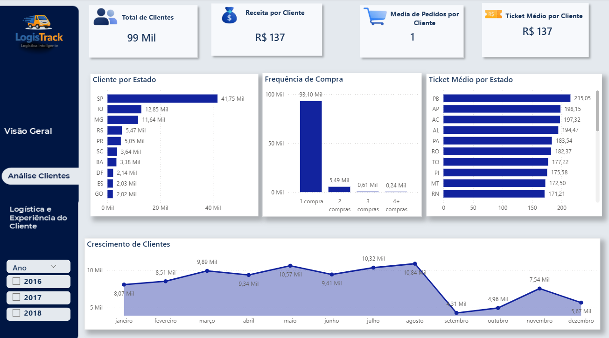
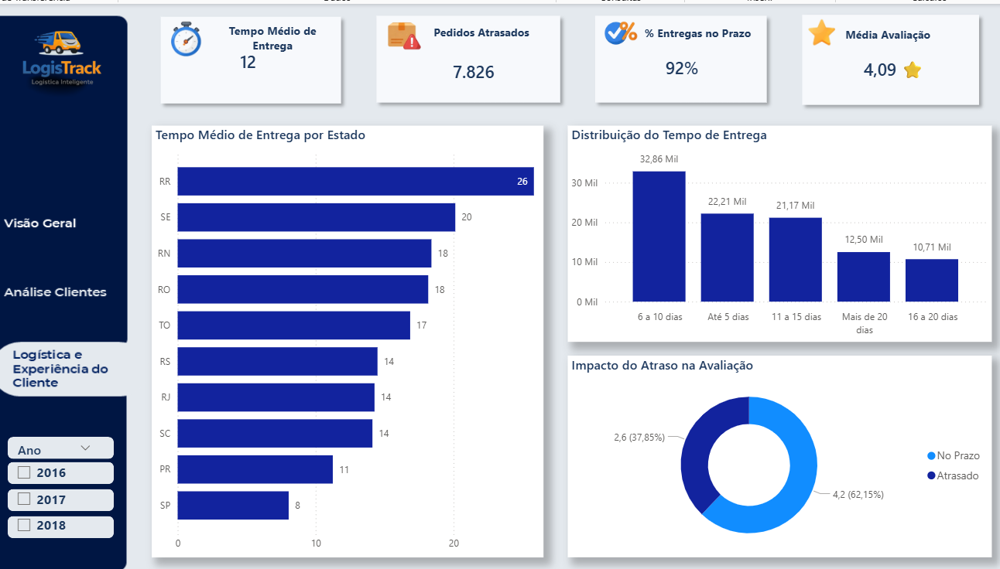

#  E-commerce Analytics — Performance, Retenção e Experiência do Cliente

---

##  Visão de Negócio

Este projeto simula a atuação de um Analista de BI em um ambiente de marketplace digital, com foco em:

- Monitoramento de KPIs de negócio  
- Identificação de oportunidades de crescimento  
- Análise de comportamento do cliente  
- Avaliação de impacto operacional na experiência do usuário  

A proposta é transformar dados em decisões estratégicas que impactam diretamente receita, retenção e eficiência operacional.

---

##  Problema de Negócio

Marketplaces digitais enfrentam desafios críticos relacionados a:

- Baixa recorrência de clientes  
- Ineficiência logística  
- Variação na experiência do usuário  
- Necessidade de crescimento sustentável  

Diante disso, surgem as seguintes perguntas:

- Onde estamos perdendo clientes?  
- O que impacta a retenção e recompra?  
- Como a logística influencia a satisfação do cliente?  
- Quais alavancas podem aumentar receita e eficiência?  

---

##  Objetivo

- Analisar o desempenho geral do marketplace  
- Entender o comportamento e retenção de clientes  
- Avaliar impacto logístico na experiência do usuário  
- Gerar recomendações estratégicas orientadas a dados  

---

##  Dataset

- **Brazilian E-Commerce Public Dataset (Olist)**  
- Dados reais de pedidos entre 2016 e 2018  

Contém informações de:

- Pedidos  
- Clientes  
- Produtos  
- Pagamentos  
- Avaliações  
- Entregas  

---

##  Tecnologias Utilizadas

- SQL (extração e transformação de dados)  
- Power BI (visualização e análise)  
- Python (tratamento e exploração de dados)  
- DAX (modelagem de métricas)  

---

#  Estrutura da Análise

O projeto foi estruturado em três pilares principais de negócio:

---

## 1️⃣ Performance do Marketplace

### KPIs Monitorados

- Receita Total: R$ 13,6 milhões  
- Total de Pedidos: ~99 mil  
- Ticket Médio: R$ 137  
- Total de Clientes: ~99 mil  
- Tempo Médio de Entrega: 12 dias  
- Avaliação Média: 4,09  

### Principais Análises

- Evolução da receita ao longo do tempo  
- Categorias com maior geração de receita  
- Distribuição geográfica das vendas  
- Métodos de pagamento  

---

## 2️⃣ Comportamento e Retenção de Clientes

### KPIs

- Receita por cliente  
- Frequência de compra  
- Ticket médio por cliente  

### Principais Insights

- A maioria dos clientes realiza apenas **1 compra**  
- Baixa recorrência indica oportunidade de retenção  
- Concentração de clientes na região Sudeste  

---

## 3️⃣ Logística e Experiência do Cliente

### KPIs

- % Entregas no prazo: 92%  
- Pedidos atrasados: 7.826  
- Tempo médio de entrega: 12 dias  
- Avaliação média: 4,09  

### Principais Insights

- Atrasos impactam diretamente a avaliação do cliente  
- Estados com maior tempo de entrega apresentam pior experiência  
- Logística é fator crítico para satisfação e retenção  

---

#  Principais Insights de Negócio

- O marketplace apresenta forte volume de vendas, porém baixa retenção de clientes  
- A maioria dos usuários não retorna após a primeira compra  
- A logística influencia diretamente a satisfação do cliente  
- A eficiência operacional impacta indicadores de experiência e reputação  
- Existe oportunidade clara de aumento de receita via retenção  

---

#  Hipóteses de Negócio

1. Melhorar o tempo de entrega aumenta a satisfação e retenção  
2. Clientes com boa experiência inicial têm maior probabilidade de recompra  
3. Incentivos na primeira compra podem aumentar recorrência  
4. Regiões com pior logística apresentam maior churn  

---

#  Propostas de Experimentação

###  Experimento 1 — Logística

- Redução do prazo de entrega para novos clientes  
- Medir impacto em:
  - Avaliação  
  - Retenção  
  - Recompra  

---

###  Experimento 2 — Retenção

- Campanhas de incentivo pós-primeira compra  
- Testar:
  - Cupons  
  - Frete grátis  
  - Comunicação personalizada  

---

###  Experimento 3 — Segmentação

- Criar estratégias específicas por região  
- Foco em estados com pior performance logística  

---

#  Impacto Esperado no Negócio

- Aumento da retenção de clientes  
- Crescimento do LTV (Lifetime Value)  
- Redução do churn  
- Aumento de receita sem necessidade de aquisição  

 Resultado esperado: crescimento sustentável do marketplace

---

#  Recomendação Estratégica

- Priorizar melhorias logísticas como alavanca de experiência  
- Criar estratégias focadas na primeira jornada do cliente  
- Implementar cultura de experimentação contínua (A/B Tests)  
- Monitorar retenção como KPI principal de crescimento  

---

#  Dashboard

## Visão Geral

## Análise de Clientes

## Logística e Experiência

---

#  Diferenciais do Projeto

- Análise end-to-end de um marketplace  
- Integração entre dados de negócio, cliente e operação  
- Foco em impacto estratégico  
- Aplicação de pensamento orientado a produto  
- Proposição de experimentos para crescimento  

---

#  Próximos Passos

- Implementação de análise de cohort (retenção ao longo do tempo)  
- Modelagem de churn  
- Previsão de demanda logística  
- Segmentação avançada de clientes  

---

# 👨‍💻 Autor

**Weslley Marques**  
LinkedIn: www.linkedin.com/in/weslley-marques-86a28937b
